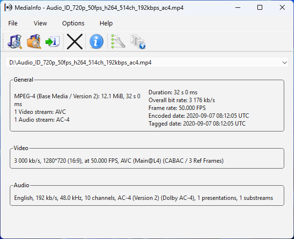
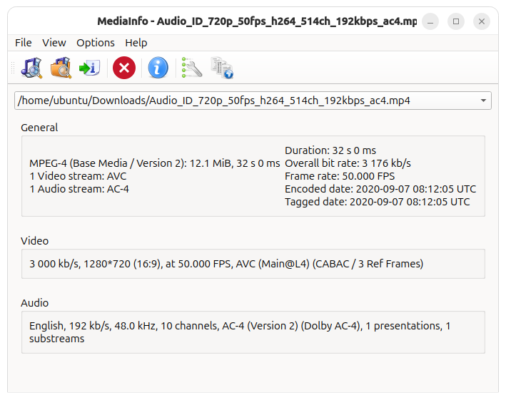
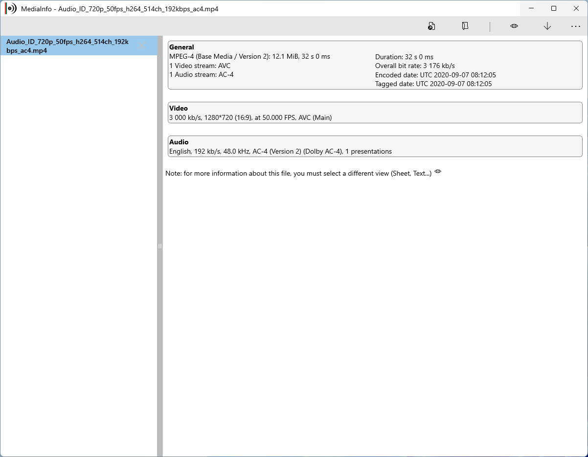
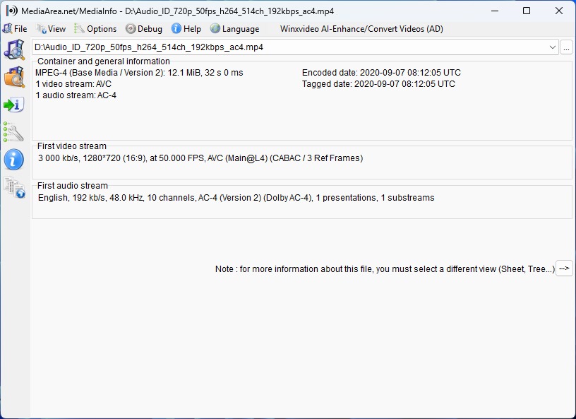
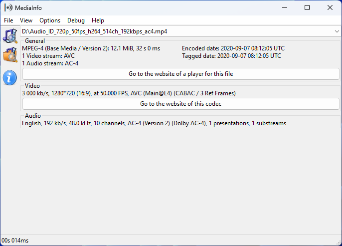
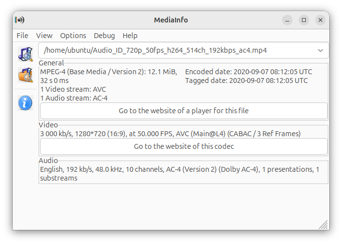

# MediaInfo README

MediaInfo is a convenient unified display of the most relevant technical and tag data for video and audio files.

[](https://github.com/MediaArea/MediaInfo/actions/workflows/MediaInfo_Checks.yml) [](https://github.com/MediaArea/MediaInfo/actions/workflows/MediaInfo-Qt_Checks.yml) [](https://github.com/MediaArea/MediaInfo/actions/workflows/MediaInfo-Android_Checks.yml)

## About

This repository contains the source code of the CLI and GUI for [MediaInfoLib](https://github.com/MediaArea/MediaInfoLib).

The CLI is available on various desktop operating systems.

There are a few different GUIs for Windows and Linux as shown below. Android and Apple's operating systems have their own GUIs too.

|                   | Windows                                                                     | Linux                                                                     |
| ----------------- | --------------------------------------------------------------------------- | ------------------------------------------------------------------------- |
| **Qt GUI**        |         |         |
| **UWP GUI**       |        |                                                                           |
| **VCL GUI**       |        |                                                                           |
| **wxWidgets GUI** |  |  |

The CLI and GUIs are available for various CPU architectures.

## How to build MediaInfo

### Index

- [Build for Windows](#build-for-windows)
  - [Prerequisites](#prerequisites)
  - [Build Windows CLI](#build-windows-cli)
  - [Build Windows GUI](#build-windows-gui)
    - [Qt GUI](#qt-gui)
    - [VCL GUI](#vcl-gui)
    - [wxWidgets GUI](#wxwidgets-gui)
- [Build for macOS and Linux](#build-for-macos-and-linux)
  - [Dependencies under macOS](#dependencies-under-macos)
  - [Dependencies under Linux](#dependencies-under-linux)
  - [Build MediaInfo CLI](#build-mediainfo-cli)
  - [Build MediaInfo GUI](#build-mediainfo-gui)
  - [Build MediaInfo Qt GUI](#build-mediainfo-qt-gui)
- [Build for other operating systems](#build-for-other-operating-systems)

### Build for Windows

MediaInfo can be built on Windows for x86, x86-64/x64/amd64 and arm64 CPU architectures.

#### Prerequisites

The following are the common prerequisites that are required in order to build the CLI or any of the GUI on Windows.

##### Software

- Git for Windows (<https://gitforwindows.org/>) and/or GitHub Desktop (<https://desktop.github.com/>)
- Visual Studio 2022 Community Edition (<https://visualstudio.microsoft.com/vs/community/>) or other editions

##### Repositories

Create an empty folder and clone the following repositories using Git or GitHub Desktop:

- This repository (<https://github.com/MediaArea/MediaInfo>)
- <https://github.com/MediaArea/MediaInfoLib>
- <https://github.com/MediaArea/ZenLib>
- <https://github.com/MediaArea/zlib>

If you need Curl or the Graph Plugin, they may be obtained from [MediaArea-Utils-Binaries](https://github.com/MediaArea/MediaArea-Utils-Binaries) and [MediaInfo-Graph-Plugin-Binaries](https://github.com/MediaArea/MediaInfo-Graph-Plugin-Binaries) respectively.

The rest of this guide will assume that you are in this newly created folder. It is also assumed that you have the development tools in the `PATH` by either opening a developer command prompt, calling the appropriate batch file or manually adding them to `PATH`.

#### Build Windows CLI

To build with Visual Studio IDE, open `MediaInfo\Project\MSVC2022\MediaInfo.sln` and build **MediaInfo-CLI** project.

To build with command line:

```cmd
MSBuild -t:MediaInfo-CLI -p:Configuration=Release;Platform=x64 MediaInfo\Project\MSVC2022\MediaInfo.sln
```

To run the CLI:

```cmd
MediaInfo\Project\MSVC2022\x64\Release\MediaInfo.exe
```

#### Build Windows GUI

There are multiple GUIs utilizing different GUI frameworks on Windows. Each of the GUIs have different designs and feature sets. The supported Windows versions and CPU architectures depend on the GUI frameworks.

##### Qt GUI

Install Qt for open source use (<https://www.qt.io/download-qt-installer-oss>) if you do not have Qt installed yet. It is recommended to use the latest version or at least 6.8.0 for Windows 11.

Prepare the prerequisites by running the following commands:

```cmd
MSBuild -t:MediaInfoDLL -p:Configuration=Release;Platform=x64 MediaInfoLib\Project\MSVC2022\MediaInfoLib.sln
xcopy /y MediaInfoLib\Project\MSVC2022\x64\Release\ZenLib.lib ZenLib\Project\MSVC2022\x64\Release\
call MediaInfo\Source\GUI\Qt\Qt_Translations_Updater\update_Qt_translations.cmd
```

The Qt GUI can be built by opening `MediaInfo\Project\QMake\GUI\MediaInfoQt.pro` in Qt Creator or by using the command line:

```cmd
qmake.exe MediaInfo\Project\QMake\GUI\MediaInfoQt.pro -spec win32-msvc "CONFIG+=qtquickcompiler" && jom.exe qmake_all
jom.exe
```

To run the GUI using Qt Creator, press `Ctrl` + `R`.

To run the GUI using command line, the Qt dependencies need to be deployed first:

```cmd
windeployqt --no-quick-import --no-translations --no-system-d3d-compiler --no-system-dxc-compiler --no-compiler-runtime --no-opengl-sw x64\MediaInfo.exe
```

Then the GUI can be run:

```cmd
x64\MediaInfo.exe
```

##### VCL GUI

Install C++Builder 12 Community Edition (<https://www.embarcadero.com/products/cbuilder/starter>) and install the following dependencies from `Tools` > `GetIt Package Manager`:

- VCL Windows Style - Windows11 Dark 1.0 by Embarcadero Technologies
- EdgeView2 SDK 1.0.2739.1 by Microsoft

Prepare the dependencies by running the following commands:

```cmd
MSBuild -t:MediaInfoDLL -p:Configuration=Release;Platform=x64 MediaInfoLib\Project\MSVC2022\MediaInfoLib.sln
xcopy /y MediaInfoLib\Project\MSVC2022\x64\Release\MediaInfo.dll MediaInfo\Project\BCB\GUI\Win64x\Release\
xcopy /y "C:\Program Files (x86)\Embarcadero\Studio\23.0\Redist\win64\WebView2Loader.dll" MediaInfo\Project\BCB\GUI\Win64x\Release\
robocopy MediaInfo\Source\Resource\Plugin MediaInfo\Project\BCB\GUI\Win64x\Release\Plugin /mir
call "C:\Program Files (x86)\Embarcadero\Studio\23.0\bin\rsvars.bat"
MSBuild /t:Build /p:Configuration=Release;Platform=Win64x zlib\contrib\BCB\zlib.cbproj
MSBuild /t:Build /p:Configuration=Release;Platform=Win64x ZenLib\Project\BCB\Library\ZenLib.cbproj
```

The VCL GUI can be built by opening `MediaInfo\Project\BCB\GUI\MediaInfo_GUI.cbproj` in C++Builder or by using the command line:

```cmd
MSBuild /t:Build /p:Configuration=Release;Platform=Win64x MediaInfo\Project\BCB\GUI\MediaInfo_GUI.cbproj
```

To run the GUI:

```cmd
MediaInfo\Project\BCB\GUI\Win64x\Release\MediaInfo_GUI.exe
```

##### wxWidgets GUI

Clone <https://github.com/MediaArea/wxWidgets> to obtain the required wxWidgets source.

To build with Visual Studio IDE, open `MediaInfo\Project\MSVC2022\MediaInfo.sln` and build **MediaInfo-GUI** project.

To build with command line:

```cmd
MSBuild -t:MediaInfo-GUI -p:Configuration=Release;Platform=x64 MediaInfo\Project\MSVC2022\MediaInfo.sln
```

To run the GUI:

```cmd
MediaInfo\Project\MSVC2022\x64\Release\MediaInfo-GUI.exe
```

### Build for macOS and Linux

First, you must create a directory which will receive the MediaInfo directory, and ZenLib and MediaInfoLib if you decide to compile them yourself.

In this document, this directory will be referred as $BUILD_DIR.

#### Dependencies under macOS

##### MacPorts

Some dependencies are available with MacPorts. To install MacPorts:
<https://guide.macports.org/#installing>

```sh
port install autoconf automake libtool pkgconfig zlib wxWidgets-3.0
```

*MediaArea tools*

- [libzen](#zenlib)
- [libmediainfo](#mediainfolib)

#### Dependencies under Linux

##### Listing

*Build tools*

- git
- automake
- autoconf
- libtool
- pkgconfig
- make
- g++

*MediaArea tools*

- libzen0
- libmediainfo0

*CLI and GUI dependencies*

- zlib

*GUI only dependencies*

- wxwidgets

##### Ubuntu

*Build tools and CLI/GUI dependencies*

```sh
apt-get install git automake autoconf libtool pkg-config make g++ zlib1g-dev
```

*MediaArea tools*

Go to https://mediaarea.net/fr/MediaInfo/Download/Ubuntu and download the libmediainfo0, libmediainfo-dev, libzen0 and libzen-dev packages corresponding to your Ubuntu version. Then install them with :

```sh
dpkg -i libmediainfo* libzen*
```

*GUI only dependencies*

```sh
apt-get install libwxgtk3.2-dev
```

##### Fedora

*Build tools and CLI/GUI dependencies*

```sh
sudo yum install git automake autoconf libtool pkgconfig make gcc-c++ zlib-devel
```

*MediaArea tools*

Go to <https://mediaarea.net/fr/MediaInfo/Download/Fedora> and download the libmediainfo0, libmediainfo-devel, libzen0 and libzen-devel packages corresponding to your Fedora version and CPU architecture. Then install them with :

```sh
sudo yum install libmediainfo*.rpm libzen*.rpm
```

*GUI only dependencies*

```sh
sudo yum install wxGTK-devel desktop-file-utils
```

##### Debian

*Build tools and CLI/GUI dependencies*

```sh
apt-get install git automake autoconf libtool pkg-config make g++ zlib1g-dev
```

*MediaArea tools*

Go to <https://mediaarea.net/fr/MediaInfo/Download/Debian> and download the libmediainfo0, libmediainfo-dev, libzen0 and libzen-dev packages corresponding to your Debian version. Then install them with :

```sh
dpkg -i libmediainfo* libzen*
```

*GUI only dependencies*

```sh
apt-get install libwxgtk3.0-dev
```

##### OpenSUSE

*Build tools and CLI/GUI dependencies*

```sh
zypper install git automake autoconf libtool pkgconfig make gcc-c++ zlib-devel
```

*MediaArea tools*

Go to <https://mediaarea.net/fr/MediaInfo/Download/openSUSE> and download the libmediainfo0, libmediainfo-devel, libzen0 and libzen-devel packages corresponding to your OpenSuse version. Then install them with :

```sh
rpm -i libmediainfo* libzen*
```

*GUI only dependencies*

```sh
zypper install libqt4-devel libQtWebKit-devel update-desktop-files
```

#### Build MediaInfo CLI

When you have done all the prerequisites for your configuration, then build MediaInfo. We start with the CLI.

```sh
cd $BUILD_DIR
git clone https://github.com/MediaArea/MediaInfo.git
cd MediaInfo/Project/GNU/CLI
./autogen.sh
```

Then, under macOS:

```sh
./configure --enable-staticlibs
make
```

Under Linux:

```sh
./configure --enable-shared
make
```

Or for statically linked executable, if you also build ZenLib and MediaInfoLib:

```sh
./configure --enable-staticlibs
make
```

##### Launch the CLI

```sh
./mediainfo
```

#### Build MediaInfo GUI

If you have already built the CLI, no need to run git twice. In fact, if you re-run git with an existing MediaInfo directory, git will complain and exit.

To compile MediaInfo GUI under macOS and Linux:

```sh
cd $BUILD_DIR
git clone https://github.com/MediaArea/MediaInfo.git
cd MediaInfo/Project/GNU/GUI
./autogen.sh
```

Then, under macOS:

```sh
export PATH=$PATH:/opt/local/Library/Frameworks/wxWidgets.framework/Versions/wxWidgets/3/0/bin
./configure --enable-staticlibs
make
```

Under Linux:

```sh
./configure --enable-shared
make
```

Or for statically linked executable, if you also build ZenLib and MediaInfoLib:

```sh
./configure --enable-staticlibs
make
```

##### Launch the GUI

```sh
./mediainfo-gui
```

#### Build MediaInfo Qt GUI

Install the following dependencies. Their exact names depend on the package repository of your operating system.

- qt-base-dev
- qt-svg-dev
- qt-tools-dev-tools
- qt-webengine-dev
- curl (optional)
- graphviz (optional)

Then:

```sh
qmake MediaInfo/Project/QMake/GUI/MediaInfoQt.pro -spec linux-g++ CONFIG+=qtquickcompiler && make qmake_all
make -j4
```

##### Launch the Qt GUI

```sh
./mediainfo-gui
```

#### Optional : build ZenLib and MediaInfoLib

##### ZenLib

To compile ZenLib under macOS and Linux:

```sh
cd $BUILD_DIR
git clone https://github.com/MediaArea/ZenLib.git
cd ZenLib/Project/GNU/Library
./autogen.sh
./configure --enable-static
make
```

##### MediaInfoLib

To compile MediaInfoLib under macOS and Linux:

```sh
cd $BUILD_DIR
git clone https://github.com/MediaArea/MediaInfoLib.git
cd MediaInfoLib/Project/GNU/Library
./autogen.sh
./configure --enable-static
make
```

### Build for other operating systems

Project files for other operating systems can be found in `MediaInfo/Source/GUI` and `MediaInfo/Project`.

---

MediaInfo - <https://github.com/MediaArea/MediaInfo>
Copyright (c) MediaArea.net SARL. All Rights Reserved.

This program is freeware under BSD-2-Clause license conditions.
See the [License](https://mediaarea.net/en/MediaInfo/License) for more information
